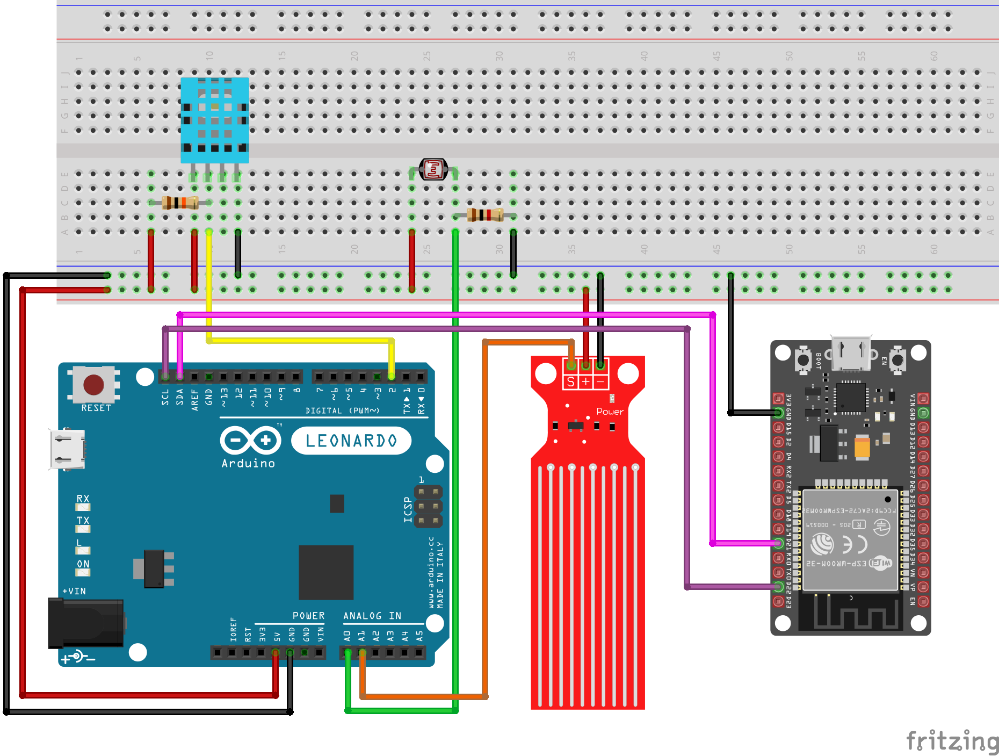

# 🌡️ Dual-MCU Environmental Monitor (ESP32 + Arduino)

This project demonstrates **I2C communication between Arduino and ESP32**, where the Arduino acts as a **sensor node (slave)** and the ESP32 as a **controller (master)**.
The ESP32 can request sensor data via I2C and send it to a **Bluetooth Serial Terminal** when the command `"stats"` is received.

---

## 🔧 Components Used

| Component                           | Quantity |
| ----------------------------------- | -------- |
| ESP32 DevKit V1                     | 1        |
| Arduino Leonardo / Uno              | 1        |
| Breadboard                          | 1        |
| DHT11 Temperature & Humidity Sensor | 1        |
| Photoresistor (LDR)                 | 1        |
| Water Level Sensor (T1592)          | 1        |
| 1kΩ Resistor                        | 1        |
| 10kΩ Resistor                       | 1        |
| Jumper Wires                        | ~15      |

---

## 📷 Circuit Diagram

---

## 🧠 How It Works

* **Arduino (Slave)**

  * Reads temperature & humidity from **DHT11**, light level from **photoresistor**, and water level from the **sensor module**.
  * Sends these readings to the **ESP32** via **I2C** when requested.
  * Also prints data to the **Serial Monitor** for debugging.

* **ESP32 (Master)**

  * Sends I2C requests to the Arduino to obtain current sensor readings.
  * When a Bluetooth terminal sends the command `"stats"`, ESP32 retrieves the latest data and sends it back via **Bluetooth Serial**.
  * Works as a wireless gateway between Bluetooth and the Arduino sensor node.

---

## 💡 Highlights

* ✅ Dual-microcontroller setup (ESP32 + Arduino)
* ✅ Real-time sensor data exchange over I2C
* ✅ Wireless monitoring via Bluetooth
* ✅ Modular design — easy to expand with new sensors
* ✅ Perfect introduction to multi-MCU and communication protocols

---

## 🧪 Planned Improvements

* Add **Wi-Fi web dashboard** for live monitoring
* Implement **data averaging & filtering**
* Expand to **MQTT** for IoT integration

---

> Made with ⚙️📡 using [Arduino IDE](https://www.arduino.cc/en/software), [Fritzing](https://fritzing.org/), and patience.