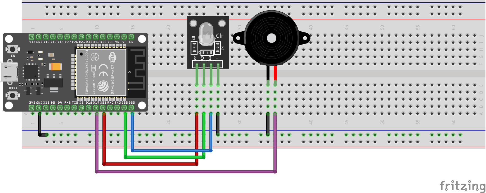

# 📈 Smart Stock Guard (ESP32 + Wi-Fi)

This project is a **Wi-Fi–enabled stock price monitoring system** built on the **ESP32**.
It fetches **live market data from the Alpha Vantage API**, displays the latest stock value on a **local web interface**, and provides **visual and sound alerts** (RGB LED + buzzer) when a stock price drops below a user-defined threshold.

---

## 🔧 Components Used

| Component              | Quantity |
| ---------------------- | -------- |
| ESP32 DevKit V1        | 1        |
| RGB LED module         | 1        |
| Active buzzer          | 1        |
| Breadboard             | 1        |
| Jumper Wires           | 7        |

---

## 📷 Circuit Diagram

---

## 🧠 How It Works

* **Wi-Fi Connection**

  * ESP32 connects to your Wi-Fi network using credentials defined in the code.
  * It periodically fetches data from the **Alpha Vantage API** to get the latest stock price.

* **Web Dashboard**

  * A lightweight **HTML interface** is hosted directly on the ESP32.
  * It displays the current stock symbol, its live price, and the configured alert threshold.
  * You can change the stock symbol (e.g., AAPL, TSLA) and alert price through the web form.

* **Alerts**

  * If the stock price **falls below** the alert threshold:

    * The **RGB LED** turns **red**.
    * The **buzzer** sounds an alert.
    * The web dashboard updates the latest price in real time.
  * If the price is above the threshold:

    * The LED turns **green** and the system stays in “normal” mode.

---

## 💡 Highlights

* ✅ Real-time stock data via **Alpha Vantage API**
* ✅ Local **web interface** with live updates (no external server needed)
* ✅ Visual and audible alerts using **RGB LED** and **buzzer**
* ✅ Modular and extendable — can later send **push notifications** or **Telegram alerts**
* ✅ Great example of **IoT meets finance**

---

## 🧪 Planned Improvements

* Add **email or mobile notifications** (via IFTTT or Telegram Bot API)
* Display **price charts** on the web interface
* Support **multiple stock symbols** with configurable tracking intervals
* Store data logs locally or on a cloud database (e.g., Firebase)

---

## ⚙️ Setup Instructions

1. Get your **Alpha Vantage API key** (free): [https://www.alphavantage.co](https://www.alphavantage.co)
2. Enter your **Wi-Fi SSID**, **password**, and **API key** in the code.
3. Upload the sketch to your ESP32 using **Arduino IDE**.
4. Open the Serial Monitor to see your ESP32’s **local IP address**.
5. Visit that IP in your browser to open the dashboard.

---

> Built with ⚙️📶 using [Arduino IDE](https://www.arduino.cc/en/software), [Alpha Vantage API](https://www.alphavantage.co), and [Fritzing](https://fritzing.org/).